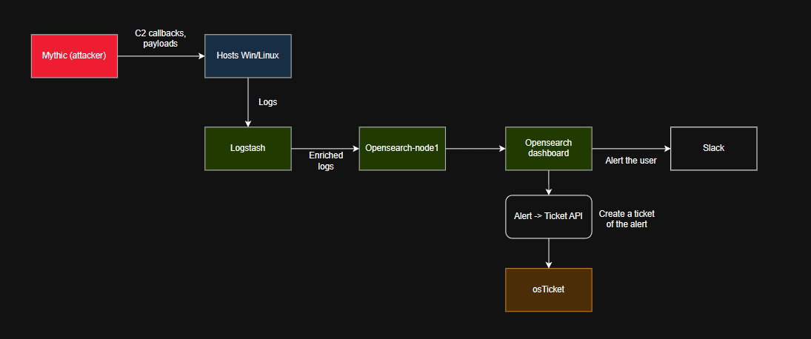
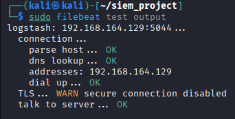
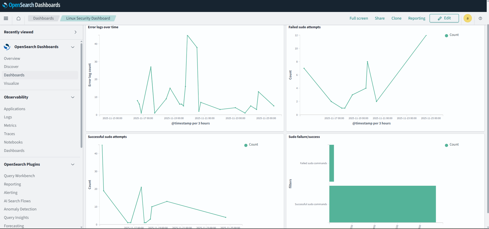
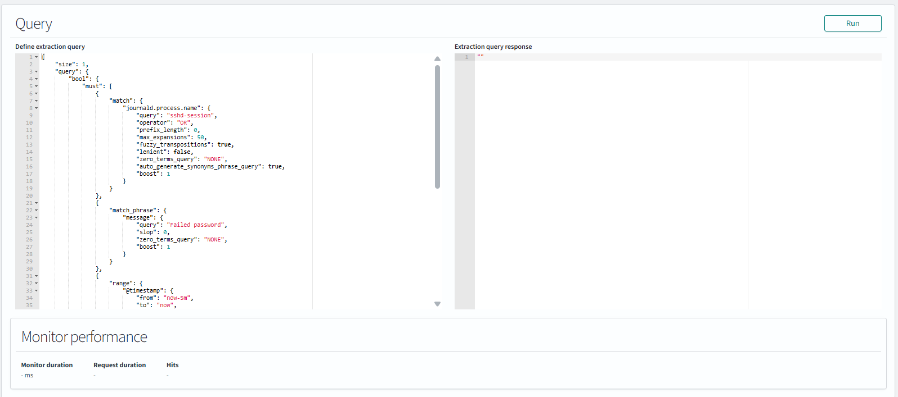
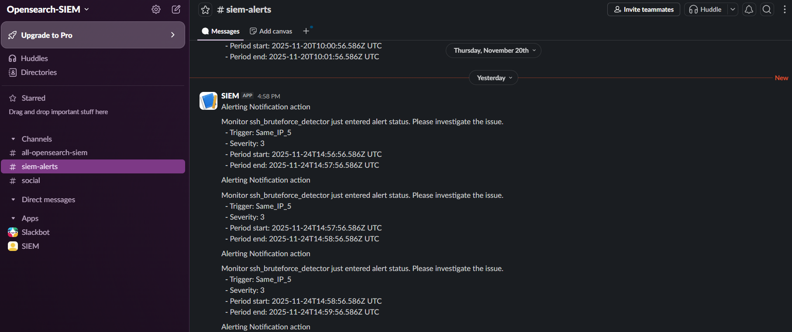
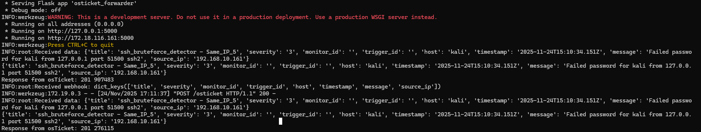
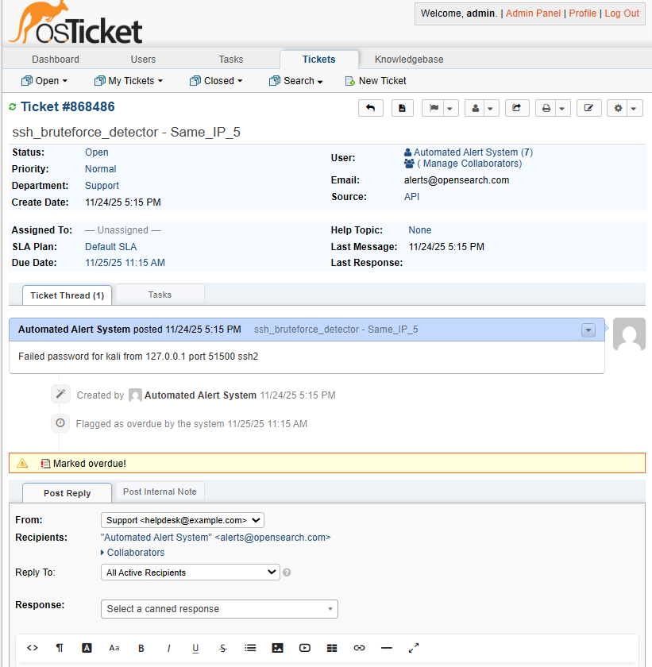

#  Opensearch SIEM Home Lab | Cybersecurity Portfolio Project

#### Author: Patrick Sunden
#### Status: <span style="color:orange">🟧 In progress</span>

---

### Technology Stack


---

# Overview

This project implements a fully functional monitoring and response lab environment that demonstates how a SOC environment detects and analyzes threats. This home lab combines log collection, centralized analysis and log aggregation, alerting, ticketing and eventually attack simulation. 

Logs from the Windows and Linux endpoints are shipped to Logstash using Winlogbeat and Filebeat, where they are parsed, enriched and sent to Opensearch, where they are stored and visualised. Detection rules in Opensearch identify suspicious activity from the logs, if suspicious activity is detected by an alert trigger, an alert is created in opensearch, user is alerted in slack (webhook from opensearch), and a ticket creation request is sent to osTicket by using a custom webhook and forwarder API.

The idea for this project is not only to present it, but also create easy to implement instructions for the environment when the project is finished.

To start with this project you need at least two virtual machines, one for monitoring and running the ticketing system, and one for testing. The monitoring virtual machine should have 8 GB of RAM and 4 vCPUs to handle opensearch and logstash. I am using Ubuntu vm as the machine that is hosting the monitoring containers, and a kali machine that is used for testing. These machines could both be Ubuntu VMs, does not really matter. 

Eventually I will implement a third virtual machine that hosts the Mythic containers for offensive actions. 
## Architecture
<p align="center">
  
</p>

## Setting up the environment (🟧 IN PROGRESS)

### STEP 1 - Install OpenSearch, Logstash, and OpenSearch Dashboards on the monitoring VM

#### 1. Clone the full repo and enter the setup folder
```bash
git clone https://github.com/patricksunden/SIEM_project.git
cd SIEM_project/setup_files
```


#### 2. Prepare the environment
You should now have in your project root:
* `docker-compose.yml` (defines containers `opensearch-node1`, `logstash`, and `opensearch-dashboards`)
* A `logstash` folder containing:
  - `Dockerfile`
* A `configs` folder containing:
  - `logstash.conf`
  - `logstash.yml`
* An `opensearch_dashboards.yml` file

#### 3. Start the stack
From your setup folder, run:
(Make sure you are using Docker Compose V2 and have docker installed on your machine: https://docs.docker.com/engine/install/ubuntu/)
```bash
sudo docker compose up -d
```

This command will start three containers needed for OpenSearch:
* `opensearch-node1`
* `logstash`
* `opensearch-dashboards`


Check that the containers are running:
```bash
sudo docker ps -a
```

#### 4. Test OpenSearch connectivity

You can interact with the cluster using curl:
```bash
curl -ku admin:"fzPkTv5b#89aDAB^Jq3J" -X GET "https://localhost:9200/_cat"
```
More information here: https://docs.opensearch.org/latest/getting-started/communicate/

Replace the password when interacting with the cluster if you’ve changed it in docker-compose.yml.

---

### STEP 2 - install Filebeat (or Winlogbeat) on each machine you want to monitor

#### 1. Important note about beats and Logstash
All variants of beats (Filebeat, Winlogbeat, Metricbeat... ) should send logs to logstash, not directly to OpenSearch.
This simplifies configuration and allows preprocessing.

#### 2. Download the correct Filebeat version
We need a specific oss-version of Filebeat for it to be compatible with Opensearch:
```bash
curl -o "filebeat-oss-7.17.13-amd64.deb" -X GET "https://artifacts.elastic.co/downloads/beats/filebeat/filebeat-oss-7.17.13-amd64.deb"
```

#### 3. Install Filebeat
```bash
sudo dpkg -i filebeat-oss-7.17.13-amd64.deb
```

#### 4. Enable Filebeat on system startup
```bash
sudo systemctl enable filebeat
```
#### 5. Configure Filebeat
The config file is located at
```bash
/etc/filebeat/filebeat.yml
```
You must configure the Filebeat -> Logstash output to point to your monitoring VM:
```yml
output.logstash:
  # The Logstash hosts
  hosts: ["<YOUR_MONITOR_HOST_IP>:5044"]
```
There are currently config files for a ubuntu machine and a kali machine. These config files should automatically have other outputs disabled and the input locations where to collect logs should be correct.

#### 6. Start and verify Filebeat
```bash
sudo systemctl start filebeat
sudo systemctl status filebeat
``` 
Status should show active (running).

You can test if Filebeat can reach the monitoring machine using the command:
```bash
sudo filebeat test output
```
If everything works, the result should look like this:
<p align="left">
   
</p>

If Filebeat fails to start up, you can view the reason in Filebeat logs using the command:
```bash
sudo journalctl -u filebeat -n 50 --no-pager
```

#### 7. Verify logs in OpenSearch Dashboard:
   - Go to Management -> Index Management -> Indexes, look for indexes starting with `filebeat*`.
   - Create an index pattern in Management -> Dashboards Management -> Index Patterns, set `filebeat*` to aggregate all Filebeat logs.
   - Go to OpenSearch Dashboards -> Discover to view logs.

### STEP 3 - Install osTicket and Python Ticket Forwarder Flask App

#### 1. Install Python and pip:
```bash
sudo apt update
sudo apt install python3 python3-pip -y
```

#### 2. Install Python venv and dependencies:
```bash
sudo apt install python3-venv -y
python3 -m venv venv
source venv/bin/activate
pip3 install -r requirements.txt
```

#### 3. Give the forwarder execution permission:
```bash
chmod +x start_forwarder.sh
```
You can start the forwarder now by running
```bash
./start_forwarder.sh
``` 
in the `setup_files`-folder. However you don't need to run it yet since we need to change the API key inside the app.

#### 4. Install the osTicket container

In the osticket folder, run:
```bash
sudo docker compose up
```

#### 5. Access the osTicket admin page
* Located at `http://localhost:8081/scp` (default credentials `ostadmin:Admin1`)
  * Port 8081 is used since there will be overlap with Mythic, default would be 8080
 
#### 6. Create an API key in osTicket

* Go to Admin panel -> Manage -> API. Add a source IP address (usually the Docker network gateway for osTicket and osTicket_db)
* Get the Docker network gateway address for osTicket with the command:
```bash
sudo docker network inspect osticket_default | grep Gateway
```
* Add this gateway address as a source IP to create the API. This api key needs to be inserted as a value for the variable `OSTICKET_API_KEY` in `osticket_forwarder.py`
Now you can start the app by running `./start_forwarder` in the `setup_files`-folder.

#### 7. Create a custom webhook in OpenSearch
* Navigate to Management -> Notifications -> Create channel
* Use channel type `Custom Webhook` with url `http://<YOUR_VM_IP_HERE>:5000/osticket`
* This will connect the webhook with the correct endpoint in the custom ticket forwarder.


### STEP 4 - Creating alert flow

Example: SSH brute-force detector

* The monitor runs a query every minute to find matching documents.

Below you can find the required information to make your first monitor, trigger and action.

Example query:
```json
{
  "size": 0,
  "query": {
    "bool": {
      "must": [
        {
          "match": {
            "journald.process.name": {
              "query": "sshd-session"
            }
          }
        },
        {
          "match_phrase": {
            "message": {
              "query": "Failed password"
            }
          }
        },
        {
          "range": {
            "@timestamp": {
              "from": "now-5m",
              "to": "now"
            }
          }
        }
      ]
    }
  },
  "aggregations": {
    "by_ip": {
      "terms": {
        "field": "source.ip.keyword",
        "size": 20
      }
    }
  }
}
```
Example trigger:
```painless
for (ip in ctx.results[0].aggregations.by_ip.buckets) {
  if (ip.doc_count > 5) {
    return true;
  }
}
return false;
```

Osticket action message:
```json
{
  "title": "{{ctx.monitor.name}} - {{ctx.trigger.name}}",
  "severity": "{{ctx.trigger.severity}}",
  "monitor_id": "{{ctx.monitor.id}}",
  "trigger_id": "{{ctx.trigger.actions.name}}",
  "host": "{{ctx.results.0.hits.hits.0._source.host.hostname}}",
  "timestamp": "{{ctx.results.0.hits.hits.0._source.@timestamp}}",
  "message": "{{ctx.results.0.hits.hits.0._source.message}}",
  "source_ip": "{{ctx.results.0.hits.hits.0._source.host.ip.0}}"
}
```

In a nutshell, the monitor gathers data every x minutes, the trigger condition creates the alert in opensearch, and runs the actions related to the trigger (user alerting and ticket forwarding).

## Workflow of the environment

A Beats agent (linux=filebeat, windows=winlogbeat) is installed on all hosts we want to monitor. These agents all send their data to Logstash, which is running on the monitoring host Ubuntu machine. This monitoring Ubuntu hosts Docker, with Opensearch, Logstash and osTicket as containers. Logstash then enriches and sorts the data, sending them to correct indexes in Opensearch-node1, these can then be visualized in opensearch-dashboards.

<p align="center">
   
</p>

We can set up a monitor in opensearch to monitor the logs that are coming in to Opensearch. We can also specify triggers and actions for these monitors. A query looks for certain things in the logs, for example the example below looks for unsuccessful ssh login attempts from the last 5 minutes (full query not in image):

<p align="center">
   
</p>
<p align="center">
   
</p>
The trigger then looks if there are more than 5 login attempts based on the results of the query. If this returns true, an alert is generated and the actions that have been specified will be fired. In this case the alert actions are sending an alert to Slack, and taking data from the query and sending a ticket creation request to osTicket via a custom API:

<p align="center">
   
</p>
<p align="center">  
   
</p>

This alert is then assigned automatically, and looks like this in osTicket:

<p align="center">
   
</p>

## To-Do
- [ ] Add more hosts to monitor and add diversity to the monitored hosts
- [ ] Add more complicated detection rules and alerts
- [ ] Create more realistic attack simulations with Mythic C2
- [ ] Possibly replacing Opensearch with Splunk
- [ ] Integrate Wazuh

## Learning outcomes

* Security monitoring and log analysis using opensearch
* Detection engineering with monitors and Mustache templates
* Networking
* Designing the architecture of a SIEM environment
* Shell scripting
* Docker
